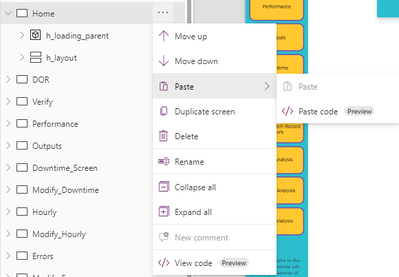

# MilliporeSigma Encapsulation Applications

## PowerApps Packages

The PowerApps packages included in the repo are full backups that can be used with the PowerApps importer to create a new app from the backup. Each package will be designated with the simple name of the application using either; LinkHub, Display, Accountability, Management, or Production and the backup date/time.

## YAML Repository

The YAML repo for all of the PowerApp applications for the MilliporeSigma Encapsulation work center can be used to quickly change and update various controls within the PowerApps.

### Using the YAML files for PowerApps

To use the YAML code you must first use PowerApps version 3.24084.21 or later. The code can then be pasted into the PowerApps content tree prompts to transfer the code into a pre-existing PowerApp.

## References

The reference folders hold various files with reference code for things like html templates, color references, svg icon implementation and more.