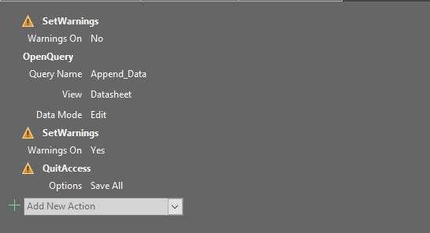
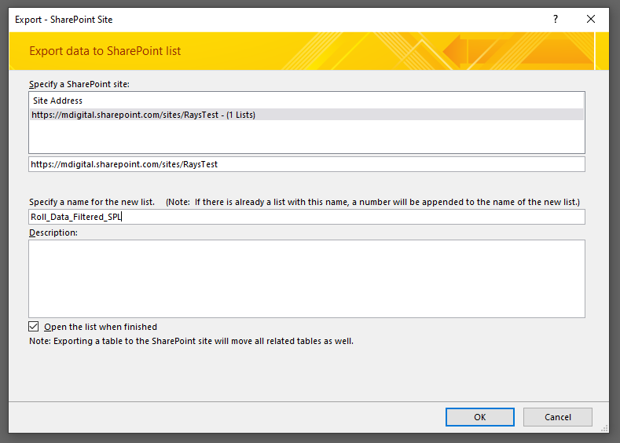
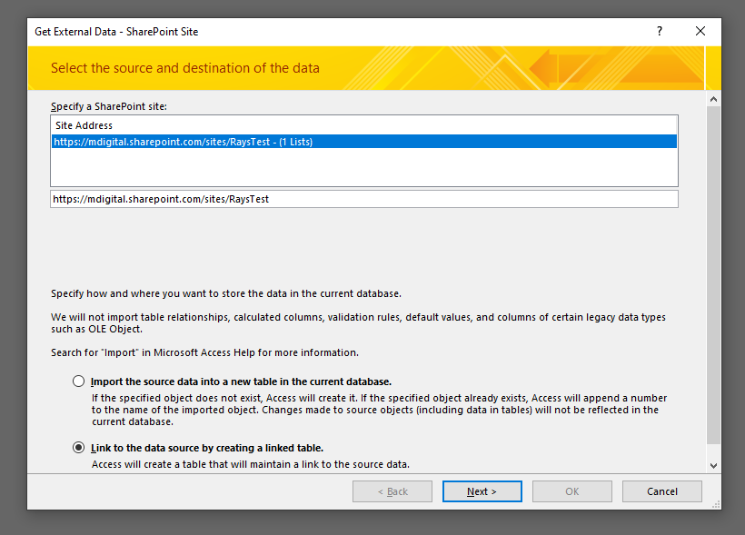
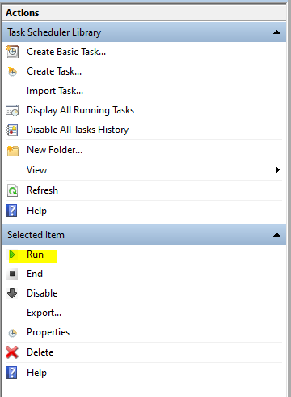

# Pleater Data Transfer
These are the instructions on how to setup the transfer of data from the Front End Access database to the SharePoint List for use with PowerApps

## Setting Up the Transfer Database

1. Create a new Access Database File. This will be used as a bridge/hook for the 'Data.accdb'.
2. Setup a linked table to the 'Roll Data' table from 'Data.aacdb' in the 'r:\' drive.
3. Setup a query called 'Table_Setup' with the following SQL code:

``` SQL
SELECT 
    [Roll Data].[Id] AS Old_Id,
    [Roll Data].[Date],
    [Roll Data].[Shift],
    [Roll Data].[Pleater],
    [Roll Data].[Work Order #],
    [Roll Data].[Lot_No],
    [Roll Data].[Catalog],
    (
        Nz([Roll Data].[Startup], 0) +
        Nz([Roll Data].[RollChange], 0) +
        Nz([Roll Data].[Membrane], 0) +
        Nz([Roll Data].[Lamination], 0) +
        Nz([Roll Data].[Support], 0) +
        Nz([Roll Data].[OOS_Pleat_Heights], 0) +
        Nz([Roll Data].[Pack_Ext], 0) +
        Nz([Roll Data].[Flagging], 0) +
        Nz([Roll Data].[Slitters], 0) +
        Nz([Roll Data].[Pack_Damage], 0) +
        Nz([Roll Data].[Under Heat], 0) +
        Nz([Roll Data].[Choppy_Pleat], 0) +
        Nz([Roll Data].[Filter_Wrinkles], 0) +
        Nz([Roll Data].[Machine_Dump], 0) +
        Nz([Roll Data].[Tracking], 0) +
        Nz([Roll Data].[Poly_Issue], 0) +
        Nz([Roll Data].[Under_post_Heat], 0) +
        Nz([Roll Data].[Seaming], 0) +
        Nz([Roll Data].[Pleat_Count], 0) +
        Nz([Roll Data].[Contamination], 0) +
        Nz([Roll Data].[Filter_Other], 0) +
        Nz([Roll Data].[Filter_Splice], 0) +
        Nz([Roll Data].[Incorrect_Threading], 0) +
        Nz([Roll Data].[Lamination_Separation], 0) +
        Nz([Roll Data].[Pack_Density], 0) +
        Nz([Roll Data].[Snaking], 0)
    ) AS Total_Reject_Pleats,
    [Roll Data].[Begin Cart #],
    [Roll Data].[End Cart #],
    [Roll Data].[PleatPerPack],
    [Roll Data].[Pleat_Height]
INTO
    Roll_Data_Filtered
FROM
    [Roll Data]
WHERE
    [Roll Data].[Date] = #01/01/1111#;
```

> I don't actually know SQL all that well, and ChatGPT came in clutch here, because of that all my SQL scripts can most likely be improved.

> This creates a new table with all the properties from the 'Data.accdb' and adds a few features needed for the SharePoint List connection. It makes this table's new record IDs connect with the 'Data.accdb' IDs without actually making it a relational database. It makes the old IDs accessible with the lists if need be. It also combines all the reject pleat records into a total (for now I don't need each individual datapoint).
>
> Within this:
>
> ```SQL
> WHERE
>     [Roll Data].[Date] = #01/01/1111#;
> ```
>
> I just try and make sure I don't pull any information into this table by making the date way out of scope.

4. Create a new query called 'Append_Data' with the following SQL code:

``` SQL
INSERT INTO Roll_Data_Filtered_SPL
    ( 
        Old_Id,
        [Date],
        Shift,
        Pleater,
        [Work Order #],
        Lot_No,
        [Catalog],
        Total_Reject_Pleats,
        [Begin Cart #],
        [End Cart #],
        PleatPerPack,
        Pleat_Height
    )
SELECT
    [Roll Data].[Id],
    [Roll Data].[Date],
    [Roll Data].[Shift],
    [Roll Data].[Pleater],
    [Roll Data].[Work Order #],
    [Roll Data].[Lot_No],
    [Roll Data].[Catalog],
    (
        Nz([Roll Data].[Startup], 0) +
        Nz([Roll Data].[RollChange], 0) +
        Nz([Roll Data].[Membrane], 0) +
        Nz([Roll Data].[Lamination], 0) +
        Nz([Roll Data].[Support], 0) +
        Nz([Roll Data].[OOS_Pleat_Heights], 0) +
        Nz([Roll Data].[Pack_Ext], 0) +
        Nz([Roll Data].[Flagging], 0) +
        Nz([Roll Data].[Slitters], 0) +
        Nz([Roll Data].[Pack_Damage], 0) +
        Nz([Roll Data].[Under Heat], 0) +
        Nz([Roll Data].[Choppy_Pleat], 0) +
        Nz([Roll Data].[Filter_Wrinkles], 0) +
        Nz([Roll Data].[Machine_Dump], 0) +
        Nz([Roll Data].[Tracking], 0) +
        Nz([Roll Data].[Poly_Issue], 0) +
        Nz([Roll Data].[Under_post_Heat], 0) +
        Nz([Roll Data].[Seaming], 0) +
        Nz([Roll Data].[Pleat_Count], 0) +
        Nz([Roll Data].[Contamination], 0) +
        Nz([Roll Data].[Filter_Other], 0) +
        Nz([Roll Data].[Filter_Splice], 0) +
        Nz([Roll Data].[Incorrect_Threading], 0) +
        Nz([Roll Data].[Lamination_Separation], 0) +
        Nz([Roll Data].[Pack_Density], 0) +
        Nz([Roll Data].[Snaking], 0)
    ) AS Total_Reject_Pleats,
    [Roll Data].[Begin Cart #],
    [Roll Data].[End Cart #],
    [Roll Data].[PleatPerPack],
    [Roll Data].[Pleat_Height]
FROM
    [Roll Data]
WHERE
    [Roll Data].[Date] >= Date()
    AND Nz([Roll Data].[End Cart #], 0) > 0
    AND [Roll Data].[Id] NOT IN (
        SELECT [Old_Id] FROM Roll_Data_Filtered_SPL WHERE [Old_Id] IS NOT NULL
    );
```
> When this query runs, it will pull new data into the table, making sure not to pull in duplicates.

5. Create a new macro called 'AutoAppendMacro' Set it up as shown below:
    - You may need to select Show All Actions in the macro editor.

    

> You know we're on the bleeding edge where 75% of this macro has the "Unsafe Action" warning.

6. Run the 'Create_Table' query.
    - This initializes the table we need to export to SharePoint
7. Export the new table called Roll_Data_Filtered to SharePoint
    - Right Click on the Table, select Export -> SharePoint List    
    - when Creating the Exported List Name the table 'Roll_Data_Filtered_SPL' 

    
8. Create a linked Table to the new SharePoint List by creating a new Table from External Data -> New Data Source -> From Online Services -> SharePoint List

    

9. Navigate to the SharePoint list, Roll_Data_Filtered_SPL, though sharepoint
    - Go to Settings -> List Settings
    - Create new indexed columns with
        - Date
        - Lot_No
        - End Cart #
    - Create a new view called 'Last 30 Days'
        - sort by Date, Descending
        - Filter by Date, is greater than or equal to, [Today]-30

Congratulations! The new Access File is setup to run.

## Automating the Data Transfer
Now that the Access Database is created. It will pull new data from the 'Roll Data' Database, but will only work when running the 'Append_Data' Query or 'AutoAppendData' Macro. We want to change this functionality to be automatic. And the most straight forward way to do this is to create a Windows Task that runs a batch file that will Open Access, run the macro, and close access every hour.

1. Create a batch file named RunAutoAppend.bat and enter these commands:
    - "C:\Program Files\Microsoft Office\root\Office16\MSACCESS.EXE"
    - "C:\dev\PowerApps\FrontEnd\Roll_Data_Transfer.accdb"
        - The first command may be the same, but the second will need to the path of the new Access file.
    - /x AutoAppendMacro

``` PowerShell
"C:\Program Files\Microsoft Office\root\Office16\MSACCESS.EXE" "C:\dev\PowerApps\FrontEnd\Roll_Data_Transfer.accdb" /x AutoAppendMacro
```

2. Create the Windows Task
    - Find Windows Task scheduler and create a new task.
    - In the General Tab
        - Name the Task Appropriately
        - Enter a description if needed
        - Under Security Options
        - Run Only when user is logged on
    - In the Triggers Tab
        - Create a new trigger
        - Set the task on a schedule
        - Set the occurrence to daily
        - Set the recurrence to 1 day
        - Under advanced settings
        - Check repeat task to every Hour
        - Check stop task if it runs longer than 30 minutes.
    - In the Actions Tab
        - Create a new Action
        - Set the action to start a program
        - Set the program to the 'RunAutoAppend.bat' file

> Its important to note that the batch file will not run correctly if the Access file is opened.

3. Test the task by manually running the batch file.

    

> If Access opens and stops with any prompts, follow this link for instructions to enable all macros to run without notifications.
>
>(https://support.microsoft.com/en-us/office/enable-or-disable-macros-in-microsoft-365-files-12b036fd-d140-4e74-b45e-16fed1a7e5c6?ns=msaccess&version=90&syslcid=1033&uilcid=1033&appver=zac900&helpid=62817&ui=en-us&rs=en-us&ad=us)

# Downtime Data Transfer - INCOMPLETE - NEEDS PROPER UPDATE
The downtime data must be transferred from CSV files located on the r:\ drive to a SharePoint List to use with Power Apps. This can be done through transferring a filtered and cleaned version of the CSV though a Power Automate Flow to the SharePoint List. These are the instructions on how to setup the data transfer.

1. Setup a folder for this data transfer in a cloud location with a service account.
2. Place the Custom CSV filter application in this folder.
    - Run the service once to create a log folder, and the output.csv file.
    - Stop the service and exit the program.
3. Create a new Blank SharePoint List. Make sure to use the proper whitespace for the column names.
    - Create Number Columns named
        - 'CSV_ID'
        - ' Downtime Minutes'
    - Create Text Columns named
        - ' Datetime Reason'
        - ' Comments'
        - 'Pleater'
4. Under settings, go to the advanced setting in the 'List Settings' Link.
5. Create new Indexed columns by clicking the 'Indexed columns' link under the column list.
    - Make the DateTime column an index.
6. Return to the advanced settings and Create a new view
    - Name the view 'Last 30 Days'
    - Make the view the default
    - Deselect the Title column display Checkmark
    - Navigate to sorting and filters
        - Sort the DateTime column in descending order
        - Filter the DateTime column by 'greater than or equal to' [Today]-30
    - Click Okay and close the new SharePoint List.
7. Create a new Power Automate Flow for the cloud.

> Follow these steps very carefully, as one mistake will break the data transfer.
```
1. From the power automate editor create a flow with the Recurrence Node
    - Set the interval to 1 and frequency to Hour
    - Set the appropriate time zone
    - Enter '2024-01-01T00:10:00Z' as the start time
2. Add a Get File Content Node for OneDrive - Business
    - Make sure it is named 'Get file content'
    - Set the file to the output.csv file we created earlier
3. Add a compose Node
    - Make sure it is named 'Compose'
    - Set the input to: base64ToString(outputs('Get_file_content')?['body']['$content'])
4. Add another compose Node
    - Name it 'Delimiter'
    - Set the input to a comma: ,
5. Add another compose Node
    - Name it 'FileContent'
    - Set the input to: replace(outputs('Compose'),'"','')
6. Add another compose Node
    - Name it 'LineEnding'
    - Set the input to: if(equals(indexof(outputs('FileContent'), decodeUriComponent('%0D%0A')), -1), if(equals(indexof(outputs('FileContent'), decodeUriComponent('%0A')), -1), decodeUriComponent('%0D'), decodeUriComponent('%0A')), decodeUriComponent('%0D%0A'))
7. Add another compose Node
    - Name it 'Headers'
    - Set the input to: split(first(split(outputs('FileContent'),outputs('LineEnding'))),outputs('Delimiter'))
8. Add an Apply to each Node
    - Make sure it is named 'Apply to each'
9. Within the apply to each loop, add a filter Node
    - Name it 'EachObject'
    - Set the from field to: range(0,length(outputs('Headers')))
    - Create one map item with,
        - Key: outputs('Headers')?[item()]
        - Value: split(items('Apply_to_each'),outputs('Delimiter'))?[item()]
10. Add another compose Node
    - Name it 'replace'
    - Set the input to: replace(replace(replace(replace(string(body('EachObject')), '{', ''), '}', ''), '[', '{'), ']', '}')
11. Add another compose Node
    - Name it 'json'
    - Set the input to: json(outputs('replace'))
12. Add a condition branch
    - Name it 'Check for Null'
    - Select the AND expression
    - Set the first value to: not(empty(outputs('json')?['ID']))
    - Set the conditional to: 'is equal to'
    - Set the second value to: true
13. In the true branch, Create a Get Items - SharePoint node
    - Make sure it is named 'Get items'
    - Select the site address of your sharepoint site from the site address dropdown
    - Select the list from the list name dropdown
    - Add the filter query advanced parameter
    - In the filter query field input: CSV_ID eq '@{outputs('json')?['ID']}' and Pleater ne '@{outputs('json')?['Pleater']}'
14. Create a second condition branch
    - Make sure it is named 'Condition'
    - Select the AND expression
    - Set the first value to: length(body('Get_items')?['value'])
    - Set the conditional to: 'is equal to'
    - Set the second value to: 0
15. In the second true branch, Add a Create Item - SharePoint Node
    - Make sure it is named 'Create item'
    - Select the SharePoint site from the Site Address dropdown
    - Select the SharePoint list from the List Name dropdown
    - Show these advanced parameters, and add the code to its input, DO NOT CHANGE THE WHITESPACE.
        DateTime: outputs('json')?[' DateTime']
        CSV_ID: outputs('json')?['ID']
        Shift: outputs('json')?[' Shift']
        Downtime Minutes: outputs('json')?[' Downtime Minutes']
        Downtime Reason: outputs('json')?[' Downtime Reason']
        Comments: outputs('json')?[' Comments']
        Pleater: outputs('json')?['Pleater']
```
8. You can now run the CSV application.