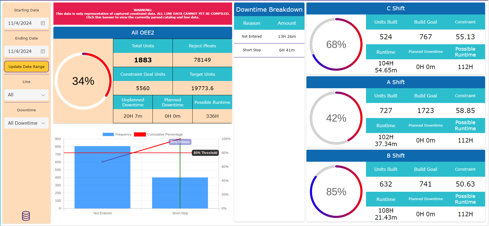
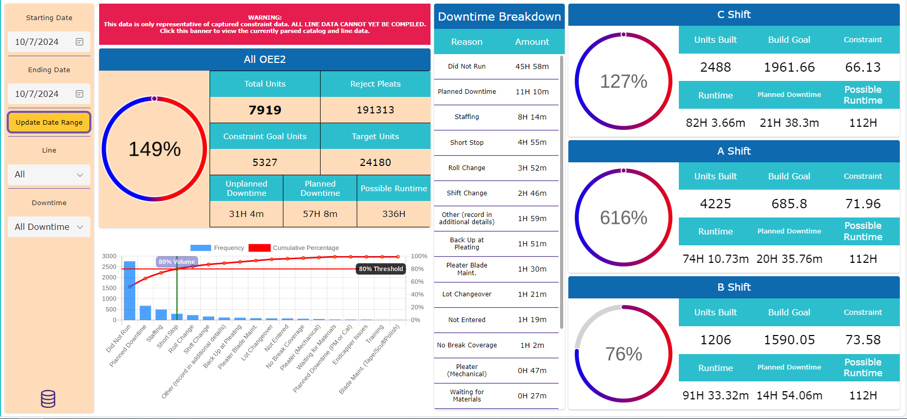

# OEE v1.5

Here is a v1.5 of the FE OEE Algorithm, produced after the 11/18/24 meeting with Chad

## Method

After speaking with Chad, the method that I collect OEE has changed. The OEE formula has stayed the same, and even my theory on creating a 'constraint_goal' variable. Instead this algorithm uses pleater packs and machine speeds as constraints to calculate the OEE. I define units here on as packs.

> OEE2 = Total Packs / Planned Packs

Planned packs now becomes the 'constraint_goal' from the previous algorithm and is plainly defined instead of relying on the base OEE2 formula definitions.

We start by clearing any data within the data structure to start clean every time the algorithm is called.

``` cpp
// Collect OEE
Clear(collectOEE2Data);
```

Then, we start a ForAll loop that iterates over all distinct production lanes (even though it states lines.. note for later, I need to change the variable name) and nest the loop into another iteration of distinct pleat per pack values (127,133,99 etc.). As before these need to be used with the With() function to allow the loop to properly init the variables within the scope of the Collect() function.

``` cpp
ForAll(distinct_prod_lines,
    With({thisLane:ThisRecord.Value},
        ForAll(Distinct(Filter(locProdFilter, thisLane in line),pleats_per_pack),
            With({thisPleatPerPack: ThisRecord.Value},
```

Next we collect all the base information we need to gather for the OEE calculation. These need to be populated in a seperate data structure, because we need to concatenate all the lane data into line data later on.

Data collected here:
- lane, the lane of the pleater we iterate over
- total_packs, a summation of the original production data filer by the amount of packs built
- pleats_per_pack, the amount of pleats per pack we iterate over
- pleats_per_hour, we return the lookup function of a data structure that holds the pleat per hour data for the line
- packs_per_hour, how many packs can be built per hour for this line, pleats_per_hour / pleats_per_pack rounded to the 4th sig. dig.

```cpp
                Collect(collectOEE2Data,
                    {
                        lane: thisLane,
                        total_packs: Sum(Filter(locProdFilter, thisLane = line, pleats_per_pack = thisPleatPerPack),amount_built),
                        pleats_per_pack: thisPleatPerPack,
                        pleats_per_hour: LookUp(pleaterSpeeds, thisLane in Line).Pleats_Per_Hour,
                        pack_per_hour:
                            IfError(
                                Round(
                                    LookUp(pleaterSpeeds, thisLane in Line).Pleats_Per_Hour
                                    / thisPleatPerPack,
                                    4
                                ),
                                0
                            )
                    }
                )
            )
        )
    )
);
```

If I filter the production data to display 6-Nov, only EF Line, the above will return a data structure that looks like this.

| lane | pack_per_hour | pleats_per_hour | pleats_per_pack | total_packs |
| ---- | ------------- |---------------- | --------------- | ----------- |
| F    | 28.3465       | 3600            | 127             | 104         |
| F    | 27.0677       | 3600            | 133             | 86          |
| E    | 28.3465       | 3600            | 127             | 108         |
| E    | 27.0677       | 3600            | 133             | 88          |

The next step in the algorithm then takes this information and combines it into a single line and adds a total runtime datapoint as well.

The downside of this algorithm starts here. It is not yet possible to collect specific runtimes for each pleat_per_pack datapoint. This means I cannot iterate over each pleat_per_pack/uptime relationship and construct an accurate account of how many packs should have been built in this time, stored in planned_packs. Instead I average the pack_per_hour data and relate it to 48 hours of runtime for the line. I chose to use 24 hours per lane here because in the future I suspect we may try and change downtime collection to represent each lane of a line to increase the accuracy of its collection.

```cpp
Clear(collectOEE2);
ForAll( // Lines
    If(
        oee_line.Selected.Value = "All",
        Distinct(pleaterSpeeds, Line),
        [oee_line.Selected.Value]
    ),
    With({thisLine: ThisRecord.Value},
        If( 
            IfError(Round(Average(Filter(collectOEE2Data, lane in thisLine), pack_per_hour),4) > 0,false),
        
            Collect(collectOEE2,
                {
                    line: thisLine,
                    pack_per_hour: Round(Average(Filter(collectOEE2Data, lane in thisLine), pack_per_hour),4), 
                    total_runtime: 48 * count_of_days, // This is a substitution for planned runtime
                    planned_packs: Round(Average(Filter(collectOEE2Data, lane in thisLine), pack_per_hour) * 48 * count_of_days,4),
                    total_packs: 0,
                    OEE2: 0
                }
            )
        )
    )   
);
```

This is returned into the collectOEE data structure. It created unpopulated columns for OEE and total_packs for the following step.

| OEE2 | line | pack_per_hour | planned_packs | total_packs | total_runtime |
| ---- | ---- | ------------- |-------------- | ----------- | ------------- |
| 0    | EF   | 27.7071       | 1329.9408     | 0           | 48            |


Finally we come to the OEE2 formula. This next ForAll() loop patches in the OEE and total_pack data into our data structure here instead of collecting new information. It very simply sums all total_pack data points from the OEEData collection to create a final total collection into each Line. Then takes our original OEE formula and collects it as well, rounding to the 4th sig. dig.

```cpp
ForAll( // Lines
    Distinct(collectOEE2, line),
    With({thisLine: ThisRecord.Value},
        If(
            Sum(Filter(collectOEE2Data, lane in thisLine),total_packs) > 0,

            Patch(collectOEE2, First(Filter(collectOEE2, line = thisLine)),
                {
                    total_packs: Sum(Filter(collectOEE2Data, lane in thisLine),total_packs),
                    
                    OEE2:
                        IfError(
                            Round(
                                Sum(Filter(collectOEE2Data, lane in thisLine),total_packs)
                                / Sum(Filter(collectOEE2, line = thisLine),planned_packs) 
                                * 100,
                                4
                            ),
                            0
                        )
                }
            )
        )
    )
);
```

The last code returns this collection:

| OEE2    | line | pack_per_hour | planned_packs | total_packs | total_runtime |
| ------- | ---- | ------------- |-------------- | ----------- | ------------- |
| 29.0238 | EF   | 27.7071       | 1329.9408     | 386         | 48            |

The final step I take is patching in an average of all the previous data we gathered. 

```cpp
Patch(collectOEE2, Defaults(collectOEE2),
    {
        line: "Average",
        pack_per_hour:Round(Average(collectOEE2, pack_per_hour),4),
        total_packs: Sum(collectOEE2, total_packs),
        planned_packs: Round(Sum(collectOEE2, planned_packs),4),
        total_runtime: Sum(collectOEE2, total_runtime),
        OEE2:
            IfError(
                Round(
                    Sum(collectOEE2, total_packs)
                    / Sum(collectOEE2, planned_packs)
                    * 100,
                    4
                ),
                0
            )   
    }
);
```

This will return this collection. Here, the average does not change because we are looking into a single line with our filters.

| OEE2    | line    | pack_per_hour | planned_packs | total_packs | total_runtime |
| ------- | ------- | ------------- |-------------- | ----------- | ------------- |
| 29.0238 | EF      | 27.7071       | 1329.9408     | 386         | 48            |
| 29.0238 | Average | 27.7071       | 1329.9408     | 386         | 48            |

# OEE2 v1.0

> OEE2 = Total Widgets / (Ideal Output * Planned Runtime)

## Gathering the information

Because PowerApps does not have a robust database structure, all data needs to be imported for manipulation in data structures called collections. Two of these collections are created when the app calls for a new set of data to manipulate. This is done on first page load, and various button presses and selections.

### Production

The first data structure that the app collects is the roll data, stored in a collection I call 'Production'. This collection is filtered by the selected dates within the app. Because of how large the dataset in the Sharepoint List is, it must also be sorted by date by most recent to increase collection speed. Big note here, because the Roll Data only collects the day of entry and not time, the data is skewed by a single hour. Processing the start and end of c shift is impossible with the current date time data format.

```cpp
ClearCollect(collectProduction,
    ForAll(
        Filter(Sort(Roll_Data_Filtered_SPL, Date, SortOrder.Descending),
            Date = locStartDate
        ),
        {
            id: Value(ThisRecord.ID),
            shift: Text(ThisRecord.Shift),
            line: Text(Upper(ThisRecord.Pleater)),
            date: DateValue(ThisRecord.Date),
            lot: Text(ThisRecord.Lot_No),
            catalog: Text(ThisRecord.Catalog),
            amount_built: Value(ThisRecord.'End Cart #') - Value(ThisRecord.'Begin Cart #') + 1,
            unit_starting: Value(ThisRecord.'Begin Cart #'),
            unit_ending: Value(ThisRecord.'End Cart #'),
            reject_pleats: Value(ThisRecord.Total_Reject_Pleats),
            pleats_per_pack: Value(ThisRecord.PleatPerPack),
            pleats_height: Value(ThisRecord.Pleat_Height)
        }
    )
);
```

### Downtime

The second data structure I create is called Downtime, also stored in a collection filtered and sorted in the same way as production. This datetime data can be collected properly, but then it would skew the data once again, so instead I conform to the date range possible with the Roll Data database. Another challenge with the database is that it also contains records for E and D shifts. Because the Roll Data only collects A, B, and C shifts, I need to lookup the time of the E or D shift entry post and convert it to A, B, or C shift entry instead. This may be the wrong approach however as trying to capture this downtime data causes the OEE formula to break (creating a negative amount of runtime when an entry pulls in data for a shift not run for 600~ minutes). Removing E and D shift downtime, normalizes this data and that may be right way to go about it instead.

```cpp
Set(varLoading,{Visible: true, Value: 20, Text: "Collecting Downtime Data"});
ClearCollect(collectDowntime,
    ForAll(
        Filter(Sort(FE_Express_DT_Events, DateTime, SortOrder.Descending),
            DateTime < DateAdd(locEndDate, 1, TimeUnit.Days),
            DateTime >= locStartDate
        ),
        {
            id: Value(ThisRecord.ID),
            csv_id: Value(ThisRecord.CSV_ID),
            shift:
                If(
                    Or(
                        ThisRecord.' Shift' = "E",
                        ThisRecord.' Shift' = "D"
                    ),
                    If(
                        And(
                            TimeValue(ThisRecord.DateTime) >= TimeValue("7:00 AM"),
                            TimeValue(ThisRecord.DateTime) < TimeValue("3:00 PM")
                        ),
                        "A",
                        And(
                            TimeValue(ThisRecord.DateTime) >= TimeValue("3:00 PM"),
                            TimeValue(ThisRecord.DateTime) < TimeValue("11:00 PM")
                        ),
                        "B",
                        "C"
                    ),
                    ThisRecord.' Shift'
                ),
            line: Text(ThisRecord.Pleater),
            date: ThisRecord.DateTime,
            reason: Text(ThisRecord.' Downtime Reason'),
            total: Value(ThisRecord.' Downtime Minutes'),
            comments: Text(ThisRecord.' Comments')
        }
    )
);
```

## Total widgets

To find the total widget part of the OEE formula, the Roll Data Access DB records a beginning and ending cartridge number. I take these numbers and retrieve an amount built from it.

``` cpp
amount_built: Value(ThisRecord.'End Cart #') - Value(ThisRecord.'Begin Cart #') + 1
```

This is complicated by the structure of the Roll Data DB, as it splits the line per lane. This means I need to collect each individual lane's cart output then combine these amount_built values into a single line record. The next piece of code is in part from a larger function, but here is the argument that collects the build amount into a variable called output we use later.

```cpp
output:
    Sum(
        Filter(locProdFilter,
            line in thisLine,       // For the line value in the line iteration, like 'E' in 'EF'
            catalog = thisCatalog
        ),
        amount_built                // Sum the amount built to combine 'E' and 'F' into 'EF'
    )
```
## Collecting the base OEE information

To collect the information for the OEE formula the Production and Downtime collections need to be collected into two separately generated data structures. One for base OEE data, and a second to gather the constraint data. These collections need to iterate over each line, each catalog and the shift.

> In this example we are only collecting overall OEE so shift data is not being separated in this case.

First I collect the base information. With a For loop, we create a data structure that PowerApps can call into itself to iterate over each lines and catalog. This is a PowerFX specific method, if we don't setup the loop in this way the conditions we try to iterate the data over will be out of 'scope' and PowerApps cannot reference them.

```cpp
/*
    For all Lines,
    For all Catalogs,
    collect output, and base constraint
*/
Clear(collectOEE2Data);
With(
    {
        theseLines:
            If(
                oee_line.Selected.Value = "All",
                Distinct(collectLineSchema, SCH_Line),
                [oee_line.Selected.Value]
            ),
        theseCatalogs: distinct_catalogs
    },
    ForAll(theseLines,
        With({thisLine: ThisRecord.Value},
            ForAll(theseCatalogs,
                With({thisCatalog: ThisRecord.Value},
```

Next I check to make sure the production data has an amount associated with it. This is because some data may come through incomplete. I use an AND operator to check and make sure the catalog has a constraint value as well. A lot of data is filtered out with this step, as a large amount of catalog/line pairings are missing constraint data.

```cpp
                    If(
                        And(
                            Sum(
                                Filter(locProdFilter,
                                    line in thisLine,
                                    catalog = thisCatalog
                                ),
                                amount_built
                            ) > 0,

                            Sum(Filter(FE_Constraints,thisCatalog = Catalog, thisLine = Line.Value),Constraint)>0
                        ),
```

I am missing line/catalog constraint parings and this causes problems with collecting a complete dataset for OEE analysis. This algorithm then can only calculate production data that has constraint data associated with it. All other data is filtered out, and thus does not represent a total representation of OEE.

> For Example, I currently have  a single constraint data point for 'WX' for catalog '110605RCVGL'. My outputs for the 6th of Novemeber show that 'WX' ran 440 units.
>
> 
>
> But when pushed through the OEE algorithm, filtered for 'WX', it displays the OEE is at 0% for the day.
>
>

This next piece of the algorithm gathers the output and constraint data for each line/catalog pairing into a collection that will be used with the final OEE formula.

```cpp
                        Collect(collectOEE2Data,
                            {
                                line: thisLine,
                                
                                catalog: thisCatalog,
                                
                                constraint:
                                    IfError(
                                        First(Filter(FE_Constraints, Line.Value = thisLine, Catalog = thisCatalog)).Constraint,
                                        0
                                    ),
                                    
                                output:
                                    Sum(
                                        Filter(locProdFilter,
                                            line in thisLine,
                                            catalog = thisCatalog
                                        ),
                                        amount_built
                                    )
                            }
                        )
                    )
                )
            )
        )   
    )
);
```

### Ideal Output and Planned Runtime

This next collection uses the same strategy as before, but instead collects the 'Ideal Output * Planned Runtime' for OEE, a variable I call the constraint_goal in the algorithm. Previously for Encapsulation this was also collected in the for loop above. However because of the challenges of these databases, it needed to be compiled differently.

To increase the accuracy of OEE, I suggest in this next method that the ideal output of OEE2 must be pulled from the constraint of each catalog and line combination, then multiplied by how long that combination ran. All these catalog\constraint relationships then need to be compiled together to create a constraint goal. A per catalog and line combination that can be added together to capture the 'Ideal Output * Planned Runtime' arguments of the OEE formula. 

> OEE2 = Total Units / (Sum an array of Ideal Output * Planed Runtime)\
> OEE2 = 100 / ((20\*3)+(25\*5))

> OEE2 = 54.04%

With the current roll data and downtime database I cannot connect the constraint data to planned runtime. This is done with my Encapsulation algorithm by referencing the date, shift, and lot information relationships between the production and downtime entries. For FE they must be calculated separately because the downtime data only contains information attributing it to a line and shift. Without lot information on the downtime data, this makes the data connections difficult but not impossible.

Yet, the only other avenue I could travel would be trying to create relationships though pure time management. Finding relationships between when downtime was entered, and when production outputs were posted. The downtime data has proper timestamps, the roll data does not, so I cannot extrapolate those relations from time either making the relationships between production and downtime data impossible.

Instead, I changed my original methodology of this part of the OEE formula and I suggest taking the total runtime then subtract any collected planned downtime. The constraint is then averaged from the collected OEE2 data. This causes an unwanted and unavoidable skewing of overall OEE2 to the average constraint of the line rather than a perfect catalog by catalog calculation.

> OEE2 = Total Units / ((Average an array of constraints) * Planned Runtime) \
> OEE2 = 100 / ((20,25) \* 8)

> OEE2 = 55.56%

```cpp
Clear(collectConstraintArray);
With({theseLines:Distinct(collectOEE2Data, line)},
    ForAll(theseLines,
        With({thisLine:ThisRecord.Value},
            If(
                CountRows(Filter(collectOEE2Data, thisLine = line)) > 0,

                Collect(collectConstraintArray,
                    {
                        line: thisLine,

                        Constraint_Goal:
                            Round(
                                (
                                    ((count_of_days * 1440)
                                    - Sum(Filter(locDownFilter, thisLine = line),total))
                                    / 60
                                )
                                * Average(Filter(collectOEE2Data, thisLine = line), constraint),
                                0
                            )
                    }
                )
            )
        )
    )
);
```

The data we need to run through the basic OEE Formula is now collected. I complete the process by, again, collecting the resulting data into another data structure that holds the final OEE data. I use the With() function here to make the creation of OEE more readable.

```cpp
/*Collect OEE2*/
Set(varLoading,{Visible: true, Value: 75, Text: "Calculating OEE2"});
Clear(collectOEE2);
With(
    {
        constraint_average:
            IfError(
                Average(Filter(collectOEE2Data, constraint > 0),
                    constraint
                ),
                0
            ),

        constraint_goal:
            IfError(
                Sum(collectConstraintArray,
                    Constraint_Goal
                ),
                0
            ),

        output:
            IfError(
                Sum(collectOEE2Data,
                    output
                ),
                0
            ),

        runtime_total:
            If(
                oee_line.Selected.Value = "All",
                1440 * 14 * count_of_days,
                1440 *  count_of_days
            ) / 60
    },
    Collect(collectOEE2,
        {          
            OEE2: // This collects our overall OEE2 percentage. It is most accurate with single lines selected in the filters.
                IfError(
                    Round((output/constraint_goal)*100,0),
                    0
                ),

            total_units: output, // The total unit output

            reject_pleats: Sum(locProdFilter, reject_pleats), // Currently all reject data is captured as pleats.

            constraint_goal: constraint_goal, // How many units are considered the Ideal Output by the amount of time selected, minus downtime.

            target_units: constraint_average * runtime_total, // This is usually calculated with a planning goal setting, but currently just uses the constraint data
            
            downtime_planned: // The amount of planned downtime within the selected date range.
                Round(
                    Sum(
                        Filter(locDownFilter,
                            reason = "No Scheduled Work" || reason = "Engineering DT" || reason = "Planned Downtime" || reason = "Did Not Run"
                        ),
                        total
                    )*1,
                    0
                ),
            
            downtime_unplanned: // The amount of unplanned downtime within the selected date range.
                Round(
                    Sum(
                        Filter(locDownFilter,
                            Not(reason = "No Scheduled Work" || reason = "Engineering DT" || reason = "Planned Downtime" || reason = "Did Not Run")
                        ),
                        total
                    )*1,
                    0
                ),

            possible_runtime: runtime_total // The total amount of runtime possible for each line by the selected date range.
            
        }
    )
);
```

# Conclusion

With what I'm trying to accomplish, collected OEE from the current databases is troublesome at best and misleading always. Because of the challenges of data retrieval and missing constraint data, the usefulness of this tool is highly questionable without a complete constraint dataset and/or database restructure. This is also under the assumption that the cart data that i'm pulling for unit counts is correct and operators enter it accurately.

This can be seen when selecting filters with bad data. Even with all the validation, duct tape, and bubblegum that I use to clean and thoroughly inspect data for consistent OEE calculations, the state of the databases contort and disturb the algorithm to vast inaccuracies when erroneous data is passed into the algorithm. 

> This is data from the 4th of November, this day has information that conforms with the OEE algorithm.




> This is data from the 7th of October, Because of all the glue holding this OEE together, I cant pinpoint what is the main cause of this problem, but the constraint data is lower than it should be, and the output data is higher.



As a precaution against these database problems, stretching myself thin a little bit to be honest, I have also been developing a backup deliverable that works the same as the Encapsulation version and only relies on sharepoint lists and manual operator entries. This would mean another satellite system in our ecosystem, another point of entry for operators, and another management requirement from leads and supervisors to review the manual data entries, but I would rather be able to deliver a working finished product rather than none at all.

Both the data retrieval and manual method applications have been stripped of all other functionality to develop them in tandem.