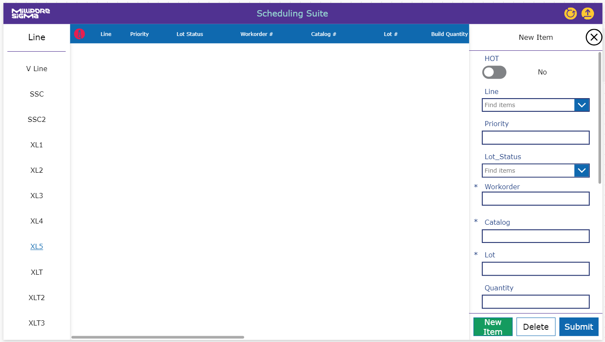

# Aggressively Realistic Timeline
## High Level
| Process            | Status            | Target Date       | Completion Date   |
| ------------------ |:-----------------:|------------------:| ----------------- |
| Custom Data Retrieval  | Completed | 01 DEC 2024 | 26 DEC 2024 |
| PowerApp Initial Build | Completed | 31 DEC 2024 | 26 DEC 2024 |
| Backup Deliverables - Manual Method | WIP | 31 JAN 2025 | --- |
| Databases Fully Established | Alpha | 14 FEB 2025 | --- |
| Service Computer Setup | Beta | 24 FEB 2025 | --- |
| OEE Algorithms Completed | Beta | 03 MAR 2025 | --- |
| PowerApp Launch | --- | 31 MAR 2025 | --- |

## Low Level
| Focus | Process            | Status            | Target Date       | Notes             |
| ----- | ------------------ |:-----------------:|------------------:| ----------------- |
| ----- | PowerApp for Production | Cancelled | --- | Time loss |
| ----- | New FE Reject Database | Cancelled | --- | Time loss |
| ----- | Initial Database Setup | Cancelled | --- | Time loss |
| ----- | Custom CSV Loader Program - Flet | Completed | 25 OCT 2024 | --- |
| ----- | Custom CSV Loader Program - CLI | Completed | 25 OCT 2024 | --- |
| ----- | Access DB connection to PowerApp Established | Completed | 15 NOV 2024 | --- |
| ----- | Complete Constraint Data | Completed | 17 JAN 2025 | Using Nominals for v1 |
| +++++ | Backup Deliverable - Production | WIP | 31 JAN 2025 | --- |
| +++++ | Backup Deliverable - Management | WIP | 31 JAN 2025 | --- |
| ----- | Data Connections Established - Initial | Alpha | 31 JAN 2025 | --- |
| ----- | PowerApp for Management - Initial Build | Completed | 14 FEB 2025 | --- |
| ----- | Power Bi connection to PowerApp Established | Cancelled | 21 FEB 2025 | --- |
| ----- | Service PC Setup | Completed | 24 FEB 2025 | --- |
| ----- | Data Connections Established - Final | Cancelled | 24 FEB 2025 | --- |
| ----- | OEE Algorithms Completed | Alpha | 03 MAR 2025 | --- |
| ----- | PowerApp for Management - Alpha | Cancelled | 10 MAR 2025 | Bug Fixes |
| ----- | PowerApp for Management - Beta | Cancelled | 17 MAR 2025 | Bug Fixes |
| ----- | PowerApp for Management - Launch | Cancelled | 31 MAR 2025 | Projected Launch Day |

*Subject to changes*

## Current Challenges

- Time loss due to scope change - Mid September
    - Previously acquired assets from the Encapsulation Application are non-transferrable. (Old app templates, database structure)
    - Formula and Algorithm scope has changed, more complex, non-transferrable
    - New knowledge of processes, programs and data transfer are required before actionable progress can be made. 
    - The new work constraints have created a large change of scope for the project.
    - These new project constraints include:
        - No new inputs for Operators
        - Working with legacy data sources, Access, CSV files
        - Legacy data structures cannot be altered, only hooked into
        - Large databases inhibit automatic information transfer and manipulation
    - Most Useability functions to be scrapped and focus turned to OEE2.

- Missing Lot Information for downtime collection
    - Downtime tracking will not be as robust as the Encapsulation version.
    - A simple graphing version can still be made for downtime reasons, but only
        the built in reasons from the CSV and not the updated LSPS downtime codes
    - OEE2 Calculations will be simplified, robust data filtering cannot be achieved

- Planned Runtime cannot be captured with this initial version
    - Runtime must be simplified to true/false system.
        - If a pleater runs, assume 8 hour runtime, if not assume no runtime.
    - A new system will need to be created to track proper runtime for a v2

- Constraint data not complete, pleater speed per catalog per line cannot be captured.
    - Pleater speeds constraints will be adjusted to averages for v1
        - 120ppm for Express/HighSpeed
        - 60ppm for Main/Opti
    - OEE2 will not accurately reflect data from all lines and catalogs.
        - Excludes High Area and Aervent

- Input pleater data not poka-yoke'd,
    - Output data from the roll data access database is problematic.
    - Data is not validated on entry, and is creating a problem with capturing reliable output data.

- Backup Deliverable
    - To mitigate a total failure of this semi-automatic intermediate project using existing data systems, a backup deliverable is being programmed in tandem with this project to handle all required data entries that are required to compile a complete oee2 system.

- Scope changes - 30 DEC 2024
    - Due to a change in upper management's project vision as per a one on one
        meeting with J.Tomachick on 30 DEC 2024, progress on the semi-automatic
        system was halted and the scope returned to a manual method.
    - Data acquisition will also be repurposed to focus from day to day operations
        to a high level management perspective focused on Toyota Model OEE and not
        LSPS OEE2

# A possible future of data Analysis

## The Now

Currently our data systems are functional but fractured, non-standard and non-conforming. We have various avenues of data acquisition that do not play nice with one another and also do not follow any of the same data entry standards. (IE Must have Datetime value, hourly entries, Lot Info, User Info, constraint data)

From the experience I've gained working on the OEE project, FE Durapore, Encapsulation/SSC and SSC V Line run on multiple databases across Oracle, Excel, Access, Sharepoint, NodeJS/Node Red, PowerApps, Power Bi and probably many more I am unfamiliar with. These systems track schedules, material requests, material stock, production data, downtime data, and OEE analysis. All working singular systems that run separately and with different standards, input and output data methods.

These systems, though separate, work well and keep the plant running efficiently, but in my opinion make data analysis and management by data driven decisions challenging. 

## The Goal

A unified data collection and analysis system that talks and connects with all aspects of production, materials and management. Scheduling systems that compare data with material systems. Operation systems that talk with material and management systems. Management systems that can view the big picture or drill down specific constraints, stressors and successes.

All of these unified by a standard set of data acquisition, data uniformity and data integrity procedures. In house developed tools, programs and data structures that rely on local talent and management with long term support. Build the tools we need, with the standards we set, with the people who know the business. 3rd party solutions can also be an extremely viable solution, but only if they can meet a large majority of the needs of the system, using satellite systems sparingly but also with some uniformity.

- Local SQL Databases
- DJango (or Angular/Express/ASP.NET) Based Web Applications for production, engineering and management
- Integration with Oracle

## The Bridge

Usage of all known and newly experimental methods of data analysis and management systems to get as close to a unified system as possible.

- This could include a standardized approach data entry.
    - This could mean migrating to a full Power Platform System with Dataverse, using powerapps as a manual method.
    - Or instead, a standardized approach using an automated method to pull data from machines and use Access Databases.
- Then standardize an approach to data views and analysis.
    - This could be with the Power Platform System with PowerBi.
    - I've also heard of some parts of the company using tableau.
    - We could also create our own system with python or other data analysis languages. 
- Clean and standardize scheduling, material, and planning systems away from sharepoint sites.
    - We could move all of this data to the Power Platform and Dataverse.
    > Something I've already prototyped:
    > 
    > 
    - We could instead clean and refactor our Oracle system to unify these tools instead.
- Temporarily discontinue and discourage relying on satellite systems that do not adhere to these new standards.