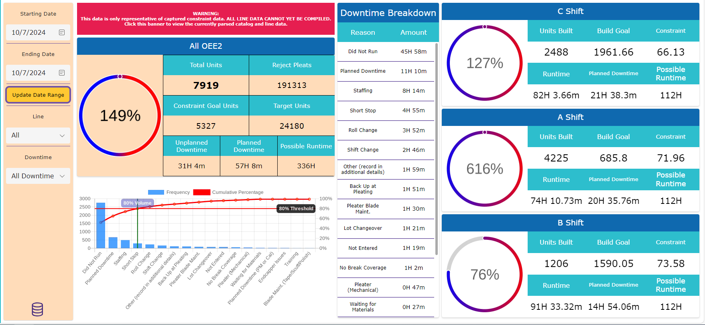

# OEE2

> OEE2 = Total Widgets / (Ideal Output * Planned Runtime)

## Gathering the information

Because PowerApps does not have a robust database structure, all data needs to be imported for manipulation in data structures called collections. Two of these collections are created when the app calls for a new set of data to manipulate. This is done on first page load, and various button presses and selections.

### Production

The first data structure that the app collects is the roll data, stored in a collection I call 'Production'. This collection is filtered by the selected dates within the app. Because of how large the dataset in the Sharepoint List is, it must also be sorted by date by most recent to increase collection speed. Big note here, because the Roll Data only collects the day of entry and not time, the data is skewed by a single hour. Processing the start and end of c shift is impossible with the current date time data format.

```cpp
ClearCollect(collectProduction,
    ForAll(
        Filter(Sort(Roll_Data_Filtered_SPL, Date, SortOrder.Descending),
            Date = locStartDate
        ),
        {
            id: Value(ThisRecord.ID),
            shift: Text(ThisRecord.Shift),
            line: Text(Upper(ThisRecord.Pleater)),
            date: DateValue(ThisRecord.Date),
            lot: Text(ThisRecord.Lot_No),
            catalog: Text(ThisRecord.Catalog),
            amount_built: Value(ThisRecord.'End Cart #') - Value(ThisRecord.'Begin Cart #') + 1,
            unit_starting: Value(ThisRecord.'Begin Cart #'),
            unit_ending: Value(ThisRecord.'End Cart #'),
            reject_pleats: Value(ThisRecord.Total_Reject_Pleats),
            pleats_per_pack: Value(ThisRecord.PleatPerPack),
            pleats_height: Value(ThisRecord.Pleat_Height)
        }
    )
);
```

### Downtime

The second data structure I create is called Downtime, also stored in a collection filtered and sorted in the same way as production. This datetime data can be collected properly, but then it would skew the data once again, so instead I conform to the date range possible with the Roll Data database.

```cpp
ClearCollect(collectDowntime,
    ForAll(
        Filter(Sort(FE_Express_DT_Events, DateTime, SortOrder.Descending),
            DateTime >= locStartDate,
            DateTime <= locEndDate
        ),
        {
            id: Value(ThisRecord.ID),
            csv_id: Value(ThisRecord.CSV_ID),
            shift: Text(ThisRecord.' Shift'),
            line: Text(ThisRecord.Pleater),
            date: ThisRecord.DateTime,
            reason: Text(ThisRecord.' Downtime Reason'),
            total: Value(ThisRecord.' Downtime Minutes'),
            comments: Text(ThisRecord.' Comments')
        }
    )
);
```

## Total widgets

To find the total widget part of the OEE formula, the Roll Data Access DB records a beginning and ending cartridge number. I take these numbers and retrieve an amount built from it.

``` cpp
amount_built: Value(ThisRecord.'End Cart #') - Value(ThisRecord.'Begin Cart #') + 1
```

This is complicated by the structure of the Roll Data DB, as it splits the line per lane. This means I need to collect each individual lane's cart output then combine these amount_built values into a single line record. The next piece of code is in part from a larger function, but here is the argument that collects the build amount into a variable called output we use later.

```cpp
output:
    Sum(
        Filter(locProdFilter,
            line in thisLine,       // For the line value in the line iteration, like 'E' in 'EF'
            catalog = thisCatalog
        ),
        amount_built                // Sum the amount built to combine 'E' and 'F' into 'EF'
    )
```
## Collecting the base OEE information

To properly collect the OEE information, data from the Production and Downtime collections need to be recursively collected into two separately generated data structures. One for base OEE data, and a second to gather the constraint data. These collections need to iterate over each line, each catalog and in the case of the shift specific version of this algorithm the shift as well.

First lets start with the basic information we need. With a For loop, we create a structure that PowerApps can call into itself to determine specific lines and catalogs to iterate over. Otherwise, the conditions we try to filter the data by will be out of scope and PowerApps cannot reference the filter.

```cpp
/*
    For all Lines,
    For all Catalogs,
    collect output, and base constraint
*/
Clear(collectOEE2Data);
With(
    {
        theseLines:
            If(
                oee_line.Selected.Value = "All",
                Distinct(collectLineSchema, SCH_Line),
                [oee_line.Selected.Value]
            ),
        theseCatalogs: distinct_catalogs
    },
    ForAll(theseLines,
        With({thisLine: ThisRecord.Value},
            ForAll(theseCatalogs,
                With({thisCatalog: ThisRecord.Value},
```

Here we need to check to make sure the production data actually has an amount associated with it, as some data comes through incomplete. We use an AND operator to check and make sure the catalog has a constraint value as well. A lot of data is filtered out with this step, as a large amount of catalog/line pairings are missing constraint data.

```cpp
                    If(
                        And(
                            Sum(
                                Filter(locProdFilter,
                                    line in thisLine,
                                    catalog = thisCatalog
                                ),
                                amount_built
                            ) > 0,

                            Sum(Filter(FE_Constraints,thisCatalog = Catalog, thisLine = Line.Value),Constraint)>0
                        ),
```

This causes another problem with collecting OEE with the current databases all data cannot be parsed though the algorithm. This algorithm can only calculate production data that has constraint data associated with it. All other data is filtered out, and thus does not represent the total capacity of a selected set of data ranges.

For Example, I currently have  a single constraint data point for 'WX' for catalog '110605RCVGL'. My outputs for the 6th of Novemeber show that 'WX' ran 440 units.


But when pushed through the OEE algorithm show that 'WX' was a 0% OEE for the day.


This next piece of the puzzle filters the data into a collection that will be used to gather the output and constraint data for specific catalogs. It collects the constraint from a Sharepoint List that houses all the current constraint data I was able to obtain thus far with the help of Jen and the total output of the catalog as well.

```cpp
                        Collect(collectOEE2Data,
                            {
                                line: thisLine,
                                
                                catalog: thisCatalog,
                                
                                constraint:
                                    IfError(
                                        First(Filter(FE_Constraints, Line.Value = thisLine, Catalog = thisCatalog)).Constraint,
                                        0
                                    ),
                                    
                                output:
                                    Sum(
                                        Filter(locProdFilter,
                                            line in thisLine,
                                            catalog = thisCatalog
                                        ),
                                        amount_built
                                    )
                            }
                        )
                    )
                )
            )
        )   
    )
);
```

### Ideal Output and Planned Runtime

This next collection uses the same strategy as before, but instead collects the 'Ideal Output * Planned Runtime' for OEE, a variable I call the constraint_goal in the algorithm. Previously for Encapsulation this was also collected in the for loop above. However because of the challenges of these databases, it needed to be compiled differently.

To increase the accuracy of OEE, I suggest in this next method that the ideal output of OEE2 must be pulled from the constraint of each catalog and line combination, then multiplied by how long that combination ran. All these catalog\constraint relationships then need to be compiled together to create a constraint goal per catalog and line combination that can simply be added together to capture the 'Ideal Output * Planned Runtime' arguments of the OEE formula. 

> OEE2 = Total Units / (Sum an array of Ideal Output * Planed Runtime)
> 
> OEE2 = 100 / ((20\*3)+(25\*5))

> OEE2 = 54.04%

With the current roll data and downtime database I cannot pull the total runtime or connecting downtime for the combined information required. They must be calculated separately because the downtime data only contains information attributing it to a line and shift. Without lot information on the downtime data, this makes the connection difficult but not impossible.

Yet, the only other avenue I could see would be trying to create relationships though pure time management. Though the downtime data has proper timestamps, the roll data does not, so I cannot extrapolate those relations from time, making the relationships between production and downtime data now impossible.

Instead, I change my original methodology of this part of the OEE formula and I suggest that the line should run all 24 hours, then subtract any collected downtime from the total possible runtime. The constraint is then averaged from the collected OEE2 data. This causes an unwanted, but unavoidable skewing of overall OEE2 to the average constraint of the line rather than a perfect catalog by catalog calculation.

> OEE2 = Total Units / ((Average an array of constraints) * Planned Runtime)
> 
> OEE2 = 100 / ((20,25) \* 8)

> OEE2 = 55.56%

It's not ideal. But, from tests it works.

```cpp
Clear(collectConstraintArray);
With({theseLines:Distinct(collectOEE2Data, line)},
    ForAll(theseLines,
        With({thisLine:ThisRecord.Value},
            If(
                CountRows(Filter(collectOEE2Data, thisLine = line)) > 0,

                Collect(collectConstraintArray,
                    {
                        line: thisLine,

                        Constraint_Goal:
                            Round(
                                (
                                    ((count_of_days * 1440)
                                    - Sum(Filter(locDownFilter, thisLine = line),total))
                                    / 60
                                )
                                * Average(Filter(collectOEE2Data, thisLine = line), constraint),
                                0
                            )
                    }
                )
            )
        )
    )
);
```

Now that we have collected the data we need to run through the basic OEE Formula, we can complete the process by, again, collecting the resulting data into another data structure that holds the completed data. I use the With() function here to make the creation of OEE more readable.

```cpp
/*Collect OEE2*/
Set(varLoading,{Visible: true, Value: 75, Text: "Calculating OEE2"});
Clear(collectOEE2);
With(
    {
        constraint_average:
            IfError(
                Average(Filter(collectOEE2Data, constraint > 0),
                    constraint
                ),
                0
            ),

        constraint_goal:
            IfError(
                Sum(collectConstraintArray,
                    Constraint_Goal
                ),
                0
            ),

        output:
            IfError(
                Sum(collectOEE2Data,
                    output
                ),
                0
            ),

        runtime_total:
            If(
                oee_line.Selected.Value = "All",
                1440 * 14 * count_of_days,
                1440 *  count_of_days
            ) / 60
    },
    Collect(collectOEE2,
        {          
            OEE2: // This collects our overall OEE2 percentage. It is most accurate with single lines selected in the filters.
                IfError(
                    Round((output/constraint_goal)*100,0),
                    0
                ),

            total_units: output, // The total unit output

            reject_pleats: Sum(locProdFilter, reject_pleats), // Currently all reject data is captured as pleats.

            constraint_goal: constraint_goal, // How many units are considered the Ideal Output by the amount of time selected, minus downtime.

            target_units: constraint_average * runtime_total, // This is usually calculated with a planning goal setting, but currently just uses the constraint data
            
            downtime_planned: // The amount of planned downtime within the selected date range.
                Round(
                    Sum(
                        Filter(locDownFilter,
                            reason = "No Scheduled Work" || reason = "Engineering DT" || reason = "Planned Downtime" || reason = "Did Not Run"
                        ),
                        total
                    )*1,
                    0
                ),
            
            downtime_unplanned: // The amount of unplanned downtime within the selected date range.
                Round(
                    Sum(
                        Filter(locDownFilter,
                            Not(reason = "No Scheduled Work" || reason = "Engineering DT" || reason = "Planned Downtime" || reason = "Did Not Run")
                        ),
                        total
                    )*1,
                    0
                ),

            possible_runtime: runtime_total // The total amount of runtime possible for each LANE of each line, for the selected date range.
            
        }
    )
);
```

# Conclusion

With what I'm trying to accomplish, collected OEE from the current databases is troublesome at best and misleading always. Because of the challenges of data retrieval and missing constraint data, the usefulness of this tool is highly questionable without a complete constraint dataset and/or database restructure. This is also under the assumption that the cart data that i'm pulling for unit counts is correct and operators enter it accurately.

This can be seen when selecting filters with bad data. This is not the extreme, but the norm when polling the data from the access db and CSV files. Even with all the loopholes, duct tape, and bubblegum that I use to clean and thoroughly inspect data for consistent OEE calculations, the state of the database contorts and disturbs the algorithm to vast inaccuracies. 

> This is data from the 4th of November, this day has information that conforms with the OEE algorithm.


> This is data from the 7th of October, Because of all the glue holding this OEE together, I cant pinpoint what is the main cause of this problem, but the constraint data is lower than it should be, and the output data is higher.



As a precaution against this, stretching myself thin a little bit to be honest, I have been also developing a backup deliverable that works the same as the Encapsulation version and only relies on sharepoint lists and manual operator entries. This would mean another satellite system in our ecosystem, anther point of entry for operators, and another management requirement from leads and supervisors to review the manual data entries, but i would rather be able to deliver another cog in the wheel than one missing teeth.

Both the data retrieval and manual method applications have been stripped of all other functionality to develop them in tandem.