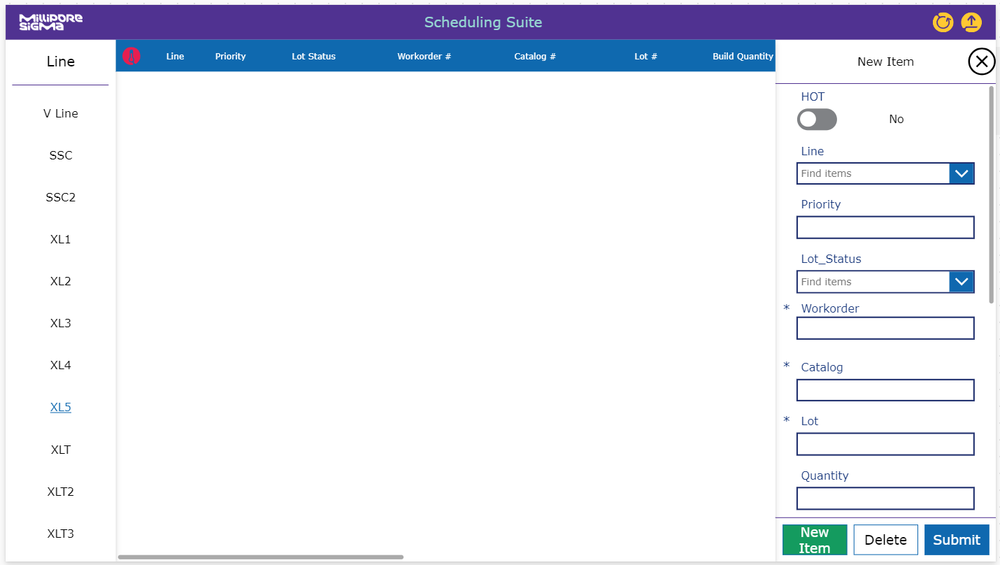

# A possible future of data Analysis

## The Now

Currently our data systems are functional but fractured, non-standard and non-conforming. We have various avenues of data acquisition that do not play nice with one another and also do not follow any standards.

The Encapsulation and SSC V lines run on multiple sharepoint databases across PowerApps and Power Bi. These systems track line schedules, material requests, production data, downtime data, and OEE analysis. All working singular systems that run separately and with different standards, input and output data methods.

Front End Durapore runs on many of these systems as well, with additional automated systems that run on separate and non-conforming access, node red, raspberry pi and CSV data structures/methods.

## The Goal

A unified data collection and analysis system that talks and connects with all aspects of production and management. Scheduling systems that compare data with material systems. Operation systems that talk with material and management systems. Management systems that can view the big picture or drill down specific constraints, stressors and successes.

All of these unified by a standard set of data acquisition, uniformity and integrity procedures. Long term supported, in house developed, tools, programs and data structures that rely on local talent and management. Build the tools we need, with the standards we set, with the people who know the business in its entirety.

- Local SQL Databases
- DJango (or Angular/Express/ASP.NET) Based Web Applications for production and management
- Integration with Oracle

## The Bridge

Usage of all known and newly experimental methods of data analysis and management systems to get as close to a unified system as possible.

- This can include a standardized approach to manual data entry into PowerApps systems to obtain daily production data.
- Then standardize an approach to data views and analysis with PowerBi systems. 
- Move all scheduling, material, and planning systems from sharepoint sites/lists to the same Power Platform systems to create a more unified environment.
    - For example, move the ugly sharepoint site schedule to a more readable PowerApp system.
    > Something I've already prototyped:
    > 
    > 
- Temporarily discontinue relying on satellite systems with access databases and direct machine connections.
- Temporarily move all data storage to the Power Platform's Dataverse

# Aggressively Realistic Timeline
## High Level
| Process            | Status            | Target Date       | Completion Date   |
| ------------------ |:-----------------:|------------------:| ----------------- |
| Custom Data Retrieval  | Final Testing | 01 DEC 2024 | --- |
| PowerApp Initial Build | WIP | 31 DEC 2024 | --- |
| Backup Deliverables - Manual Method | Alpha | 31 JAN 2025 | --- |
| Databases Fully Established | WIP | 14 FEB 2025 | --- |
| Service Computer Setup | On Hold | 24 FEB 2025 | --- |
| OEE Algorithms Completed | --- | 03 MAR 2025 | --- |
| PowerApp Launch | --- | 31 MAR 2025 | --- |

## Low Level
| Process            | Status            | Target Date       | Challenges        |
| ------------------ |:-----------------:|------------------:| ----------------- |
| PowerApp for Production | Cancelled | --- | Time loss |
| New FE Reject Database | Cancelled | --- | Time loss |
| Initial Database Setup | Cancelled | --- | Time loss |
| Custom CSV Loader Program - Flet | Completed | 25 OCT 2024 | downtime data collection broken 02-Nov |
| Custom CSV Loader Program - CLI | Completed | 25 OCT 2024 | downtime data collection broken 02-Nov |
| Access DB connection to PowerApp Established | Completed | 15 NOV 2024 | --- |
| Complete Constraint Data | On Hold | 17 JAN 2025 | --- |
| Backup Deliverable - Production | Alpha | 31 JAN 2025 | Time loss |
| Backup Deliverable - Management | Alpha | 31 JAN 2025 | Time loss |
| Data Connections Established - Initial | On Hold | 31 JAN 2025 | --- |
| PowerApp for Management - Initial Build | WIP | 14 FEB 2025 | --- |
| Power Bi connection to PowerApp Established | Cancelled | 21 FEB 2025 | --- |
| Service PC Setup | On Hold | 24 FEB 2025 | --- |
| Data Connections Established - Final | --- | 24 FEB 2025 | --- |
| OEE Algorithms Completed | WIP | 03 MAR 2025 | --- |
| PowerApp for Management - Alpha | --- | 10 MAR 2025 | Bug Fixes |
| PowerApp for Management - Beta | --- | 17 MAR 2025 | Bug Fixes |
| PowerApp for Management - Launch | --- | 31 MAR 2025 | Projected Launch Day |

*Subject to changes*

## Current Challenges

- [! NEW !] Bubble trap is going forward with myself as acting operator. Time Loss.

- [! NEW !] Encapsulation Applications are starting to need maintenance. Some mornings I am required to stop work on FE to fix complications with the degrading stability of the old applications. Updates and code refinements will be needed soon. This also means that because i'm reusing the same old codebase to complete this project, the applications i'm making for FE will need to go through the same updates and corrections.

- Time loss due to scope change
    - The first three weeks of work on the project were essentially scrapped as new information made all previous work obsolete.

- Time loss due to SADM account problems with the new Passkey system.
    - Needed to wait  2 days to compile the CSV transfer tool.

- Time extension due to scope change
    - Previously acquired assets from the Encapsulation Application are non-transferrable. (Old app templates, database structure)
    - Formula and Algorithm scope has changed, more complex, non-transferrable
    - New knowledge of processes, programs and data transfer are required before actionable progress can be made. 
    - The new work constraints have created a large change of scope for the project.

- These new project constraints include:
    - No new inputs for Operators
    - Working with legacy data sources, Access, CSV files
    - Legacy data structures cannot be altered, only hooked into
    - Large databases inhibit automatic information transfer and manipulation

Currently, because of the state of the data collection of downtime and line data The Front End DMS Management Suite will not have the same
functionality or useability as the Encapsulation version of the PowerApp. Most of the usability is being stripped, and will only focus on OEE collection.

- Missing Lot Information for downtime collection
    - Downtime tracking will not be as robust as the Encapsulation version.
    - A simple graphing version can still be made for downtime reasons, but only the built in reasons from the CSV and not the updated LSPS downtime codes
    - OEE2 Calculations will be simplified, robust data filtering cannot be achieved
    - A new system will need to be created to track Planned Runtime
        - Extracting the planned runtime cannot be achieved in the same way its calculated with the Encapsulation version

- Constraint data not complete
    - Data pulled from databases cannot be parsed though OEE algorithm without constraint data.
    - OEE2 will not accurately reflect data from all lines and catalogs.
    - OEE2 data is not complete or accurate because of the lapse of this data.

- Input pleater data not poke`okd/validated/consistent,
    - Creating output data from the roll data access database is problematic.
    - Data is not validated on entry, and is creating a problem with capturing reliable output data.

- Backup Deliverable
    - Current access and csv databases and the bridge solutions are too incomplete and unpredictable to affirm completion of a semi-automatic DMS system
    - Creating a backup deliverable with Manual Inputs and Sharepoint Databases
    - Time Loss